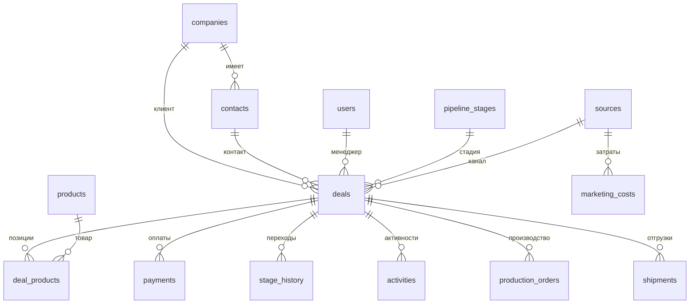
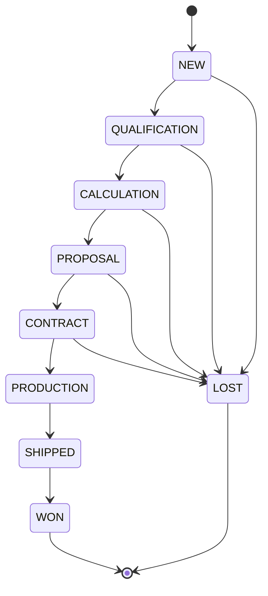
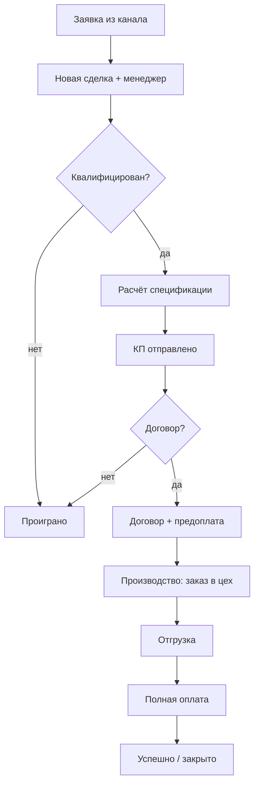

# Архитектура и модель данных

## Слои

```
CSV  →  RAW (все колонки TEXT, без ограничений, суррогатный PK)
             │  transform (Python): чистка, дедуп, проверка связей, лог
             ▼
        CORE (типы, PK / FK / CHECK, справочники)
             │
             ├─→ sources               (нормализованные каналы)
             ├─→ data_quality_issues   (журнал проблем: entity, issue_type, action)
             ▼
        Вьюхи / запросы  →  7 отчётов  →  FastAPI (JSON)  →  React-дашборд
```

- **raw** — оригинал «как есть»; ограничений нет.
- **core** — нормализованный слой; целостность гарантируют PK/FK/CHECK.
- Активная проверка и решения (fix/quarantine/flag) — в Python до вставки в core.

## Словарь таблиц

| Таблица | Что это | Ключ |
|---|---|---|
| `deals` | сделки | `deal_id` |
| `deal_products` | позиции сделки | (`deal_id`, `product_id`) |
| `products` | товары + себестоимость | `product_id` (и `sku`) |
| `payments` | оплаты | `payment_id` |
| `companies` | компании-клиенты | `company_id` |
| `contacts` | контактные лица | `contact_id` |
| `users` | сотрудники | `user_id` |
| `pipeline_stages` | стадии воронки (справочник) | `stage_id` |
| `stage_history` | журнал переходов по стадиям | `event_id` |
| `activities` | звонки/письма/задачи | `activity_id` |
| `production_orders` | производственные заказы | `production_order_id` |
| `shipments` | отгрузки | `shipment_id` |
| `marketing_costs` | затраты на рекламу по каналам | (дата/канал) |
| `sources` *(наша)* | нормализованные каналы | `id` |
| `data_quality_issues` *(наша)* | журнал проблем качества | `id` |

## ER-модель (ERD)



## FSM — автомат стадий сделки



**Нарушения автомата в данных:** сделка D1001 в истории прыгнула `QUALIFICATION → PRODUCTION`, минуя `CALCULATION/PROPOSAL/CONTRACT` (нелегальный переход); сделка D1011 стоит на стадии `WAIT_CLIENT`, которой нет в справочнике.

## BPM — процесс сделки


